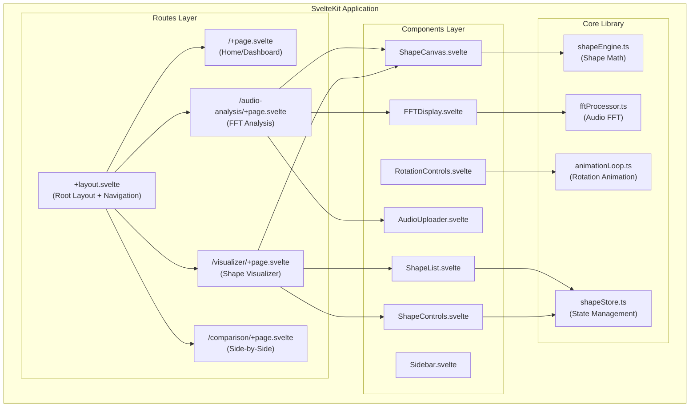
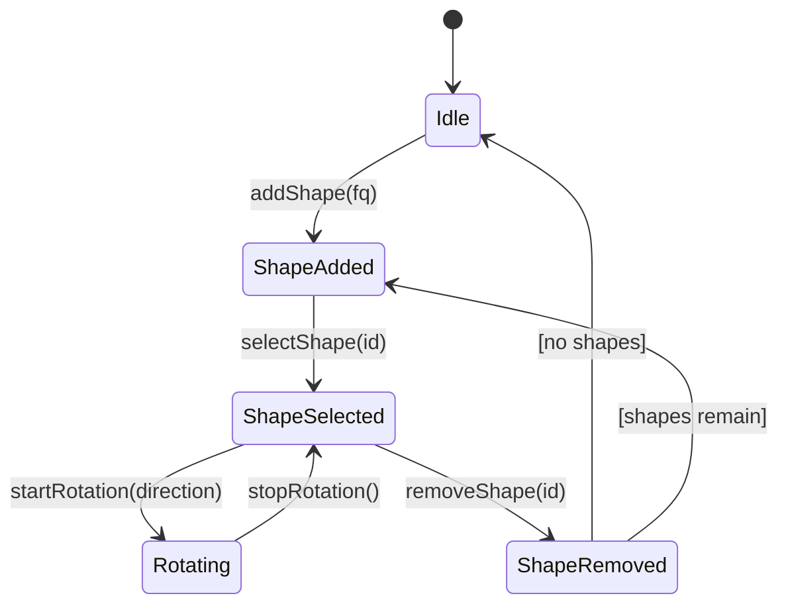
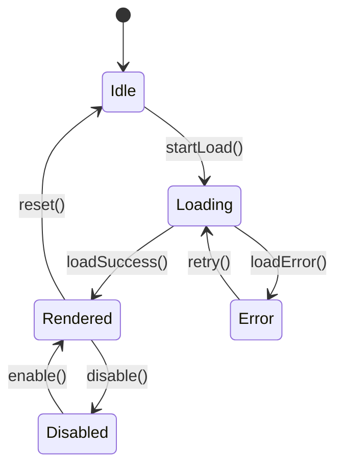

# Design Document: Frequency Shape Visualizer

## Overview

The Frequency Shape Visualizer is a SvelteKit web application that enables users to visualize frequencies as 2D geometric shapes using in-phase radial modulation. The system transforms frequency values into smooth, symmetric curves where the number of wiggles equals (frequency - 1), allowing users to explore mathematical relationships between frequency and geometric form.

The application supports:
- Manual frequency input with real-time shape rendering
- Multiple shape overlay with independent rotation controls
- Audio file FFT analysis with frequency component selection
- Side-by-side audio comparison

The architecture prioritizes structural invariance (frequency controls topology, not magnitude) and uses shadcn-svelte components with the Project Vak theme system (Premium Minimalist aesthetic with high contrast, noise textures, and brand color #df728b).

## Architecture

### High-Level Architecture



### Routing Structure

```
web-app/src/routes/
├── +layout.svelte          # Root layout with sidebar navigation
├── +page.svelte            # Home/Dashboard
├── visualizer/
│   └── +page.svelte        # Manual frequency shape visualizer
├── audio-analysis/
│   └── +page.svelte        # Audio FFT analysis
└── comparison/
    └── +page.svelte        # Side-by-side audio comparison
```

### State Management

The application uses Svelte 5 runes ($state, $derived, $effect) with a centralized store pattern:



## Components and Interfaces

### Core Shape Interface

```typescript
interface Shape {
  id: string;
  fq: number;           // Frequency (integer ≥ 1)
  R: number;            // Base radius
  phi: number;          // Phase offset (rotation)
  color: string;        // Stroke color
  opacity: number;      // Stroke opacity (0-1)
  strokeWidth: number;  // Stroke width in pixels
  selected: boolean;    // Selection state
}

interface ShapeConfig {
  A: number;            // Global wiggle amplitude (A < R)
  resolution: number;   // Sampling points (360-2048)
  canvasSize: number;   // Canvas dimensions
}


interface RotationState {
  isAnimating: boolean;
  direction: 'clockwise' | 'counterclockwise';
  mode: 'loop' | 'fixed';
  targetAngle?: number; // For fixed mode (degrees)
  speed: number;        // Angular velocity (radians/second)
}

interface FFTResult {
  frequencies: number[];  // Frequency bins (Hz)
  magnitudes: number[];   // Amplitude values
  sampleRate: number;
}

interface FrequencyComponent {
  id: string;
  frequencyHz: number;
  magnitude: number;
  fq: number;           // Mapped integer frequency
  selected: boolean;
}
```

### Component Hierarchy

```
+layout.svelte
├── Sidebar.svelte
│   ├── NavLink (shadcn Button)
│   └── ThemeToggle
└── {children}
    ├── /visualizer
    │   ├── ShapeCanvas.svelte
    │   │   └── Canvas2D (HTML Canvas)
    │   ├── ShapeControls.svelte
    │   │   ├── FrequencyInput (shadcn Input)
    │   │   ├── AddShapeButton (shadcn Button)
    │   │   └── AmplitudeSlider (shadcn Slider)
    │   ├── ShapeList.svelte
    │   │   └── ShapeItem.svelte
    │   │       ├── Checkbox (shadcn)
    │   │       ├── ColorPicker
    │   │       └── DeleteButton (shadcn Button)
    │   └── RotationControls.svelte
    │       ├── DirectionToggle (shadcn Toggle Group)
    │       ├── ModeSelect (shadcn Select)
    │       ├── SpeedSlider (shadcn Slider)
    │       └── AngleInput (shadcn Input)
    │
    ├── /audio-analysis
    │   ├── AudioUploader.svelte
    │   │   └── DropZone
    │   ├── FFTDisplay.svelte
    │   │   ├── FrequencyList
    │   │   └── SpectrumChart
    │   └── ShapeCanvas.svelte (reused)
    │
    └── /comparison
        ├── ComparisonPanel.svelte (x2)
        │   ├── AudioUploader.svelte
        │   ├── FFTDisplay.svelte
        │   └── ShapeCanvas.svelte
        └── SyncControls.svelte
```

## Data Models

### Shape Store (shapeStore.ts)

```typescript
// Svelte 5 runes-based store
interface ShapeStoreState {
  shapes: Shape[];
  config: ShapeConfig;
  rotation: RotationState;
  selectedIds: Set<string>;
}

// Store actions
type ShapeStoreActions = {
  addShape: (fq: number) => void;
  removeShape: (id: string) => void;
  selectShape: (id: string, multi?: boolean) => void;
  deselectAll: () => void;
  updateShapeProperty: (id: string, property: Partial<Shape>) => void;
  setConfig: (config: Partial<ShapeConfig>) => void;
  startRotation: (direction: 'clockwise' | 'counterclockwise', mode: 'loop' | 'fixed', targetAngle?: number) => void;
  stopRotation: () => void;
  setRotationSpeed: (speed: number) => void;
};
```

### Audio Store (audioStore.ts)

```typescript
interface AudioStoreState {
  audioBuffer: AudioBuffer | null;
  fileName: string;
  isProcessing: boolean;
  error: string | null;
  fftResult: FFTResult | null;
  frequencyComponents: FrequencyComponent[];
  normalizationStrategy: 'linear' | 'logarithmic' | 'custom';
  fqRange: { min: number; max: number };
}
```

### Comparison Store (comparisonStore.ts)

```typescript
interface ComparisonStoreState {
  leftPanel: AudioStoreState;
  rightPanel: AudioStoreState;
  syncMode: 'independent' | 'synchronized';
  sharedFrequencyScale: { min: number; max: number };
}
```

## Shape Engine (shapeEngine.ts)

### Core Shape Generation

```typescript
/**
 * Generates points for a frequency shape using in-phase radial modulation.
 * 
 * Formula: r(θ) = R + A·sin((fq-1)·θ + φ)
 * Cartesian: x = r·cos(θ), y = r·sin(θ)
 * 
 * @param fq - Frequency value (integer ≥ 1)
 * @param R - Base radius
 * @param A - Wiggle amplitude (must be < R)
 * @param phi - Phase offset for rotation (radians)
 * @param resolution - Number of sample points
 * @returns Array of {x, y} points
 */
function generateShapePoints(
  fq: number,
  R: number,
  A: number,
  phi: number,
  resolution: number
): Point[];

/**
 * Renders a shape to canvas context.
 */
function renderShape(
  ctx: CanvasRenderingContext2D,
  points: Point[],
  color: string,
  opacity: number,
  strokeWidth: number,
  centerX: number,
  centerY: number
): void;

/**
 * Validates shape parameters.
 * - fq must be integer ≥ 1
 * - A must be < R
 * - resolution must be 360-2048
 */
function validateShapeParams(fq: number, R: number, A: number, resolution: number): ValidationResult;
```

### FFT Processor (fftProcessor.ts)

```typescript
/**
 * Computes FFT on audio buffer.
 */
function computeFFT(audioBuffer: AudioBuffer, fftSize?: number): FFTResult;

/**
 * Maps FFT frequency (Hz) to integer fq value.
 * 
 * Strategies:
 * - linear: fq = Math.round(freqHz / scaleFactor)
 * - logarithmic: fq = Math.round(Math.log2(freqHz / baseFreq))
 * - custom: user-defined mapping function
 */
function mapFrequencyToFq(
  frequencyHz: number,
  strategy: NormalizationStrategy,
  options: NormalizationOptions
): number;

/**
 * Extracts top N frequency components by magnitude.
 */
function extractTopFrequencies(fftResult: FFTResult, count: number): FrequencyComponent[];
```


## Theme Integration (Project Vak)

The application follows the Project Vak "Premium Minimalist" design system as defined in THEME_MAPPING.md:

### Color Tokens

```css
/* Light Mode */
--color-background: #ffffff;
--color-foreground: #111111;
--color-card: #fafafa;
--color-border: #e5e5e5;
--color-muted: #f5f5f5;
--color-muted-foreground: #737373;

/* Dark Mode */
--color-background: #111111;
--color-foreground: #eaeaea;
--color-card: #181818;
--color-border: #333333;
--color-muted: #222222;
--color-muted-foreground: #888888;

/* Brand */
--color-brand: #df728b; /* Primary actions, shape highlights */
```

### Typography
- Primary Font: Inter (Google Fonts)
- Weights: 400 (body), 500 (buttons), 600 (subheadings), 700 (headings)
- Letter spacing: Subtle tracking for premium feel

### Visual Effects
- Noise texture overlay (opacity: 0.03) for depth
- Glassmorphism: `backdrop-blur-sm` with `bg-background/50` for floating elements
- Transitions: 0.2s ease-out for hover states
- Border radius: 0.5rem (base), 1.5rem (cards), 9999px (buttons/badges)

### Shape Visualization Colors
- Default shape stroke: `--color-foreground`
- Selected shape highlight: `--color-brand` (#df728b)
- Canvas background: `--color-card` with noise overlay
- Grid lines: `--color-border` at 0.1 opacity

## Error Handling

### Input Validation Errors

| Error Type | Trigger | User Feedback | Recovery |
|------------|---------|---------------|----------|
| Invalid frequency | fq < 1, non-integer, non-numeric | Red border on input, error message below | Maintain previous valid shape |
| Amplitude overflow | A ≥ R | Warning message, auto-clamp A to R-1 | Prevent invalid state |
| Unsupported audio format | File type not WAV/MP3/OGG | Toast notification with supported formats | Allow retry with different file |
| Audio decode failure | Corrupted or invalid audio data | Error state in uploader with retry button | Clear state, allow new upload |
| FFT processing error | Insufficient audio data | Error message with minimum requirements | Suggest longer audio clip |

### State Error Handling

```typescript
interface ErrorState {
  hasError: boolean;
  errorType: 'validation' | 'processing' | 'network' | 'unknown';
  message: string;
  retryAction?: () => void;
}
```

### Component State Machine



## Correctness Properties

*A property is a characteristic or behavior that should hold true across all valid executions of a system-essentially, a formal statement about what the system should do. Properties serve as the bridge between human-readable specifications and machine-verifiable correctness guarantees.*

Based on the acceptance criteria analysis, the following correctness properties must be verified through property-based testing:

### Property 1: Shape Formula Correctness

*For any* frequency value fq (integer ≥ 1), base radius R, wiggle amplitude A (where A < R), and phase offset φ, the generated shape SHALL have exactly (fq - 1) wiggles, where each wiggle is a local maximum in the radius function r(θ) = R + A·sin((fq-1)·θ + φ).

**Validates: Requirements 2.1, 2.2, 2.3**

### Property 2: Structural Invariance

*For any* two shapes with the same frequency (fq), the geometric point arrays SHALL be identical (within floating-point tolerance) regardless of:
- Whether the shape was created manually or from FFT analysis
- The FFT magnitude of the source frequency component
- The audio file from which the frequency was extracted

**Validates: Requirements 2.7, 2.8, 2.9, 4.8**

### Property 3: Input Validation Rejection

*For any* invalid frequency input (fq < 1, non-integer, non-numeric, empty string), the system SHALL:
- Reject the input
- Display a validation error
- Preserve the previous valid shape state unchanged

**Validates: Requirements 2.5**

### Property 4: Rotation Direction Consistency

*For any* shape with initial phase offset φ₀, after a rotation step of duration Δt with angular velocity ω:
- Clockwise rotation SHALL result in φ₁ = φ₀ - ω·Δt
- Counter-clockwise rotation SHALL result in φ₁ = φ₀ + ω·Δt

**Validates: Requirements 3.3, 3.4**

### Property 5: Fixed Rotation Accuracy

*For any* shape and specified rotation angle θ (in degrees), after fixed rotation completes:
- The phase offset SHALL change by exactly θ·(π/180) radians
- The animation SHALL stop (isAnimating = false)

**Validates: Requirements 3.6**

### Property 6: Shape Collection Integrity (Add)

*For any* shape collection of size n, after adding a new shape with frequency fq:
- The collection size SHALL be n + 1
- All previously existing shapes SHALL remain unchanged
- The new shape SHALL have the specified frequency fq

**Validates: Requirements 3.1**

### Property 7: Shape Collection Integrity (Remove)

*For any* shape collection containing shape with id X, after removing shape X:
- The collection size SHALL decrease by 1
- Shape X SHALL not exist in the collection
- All other shapes SHALL remain unchanged

**Validates: Requirements 3.7**

### Property 8: FFT Frequency-to-Shape Mapping

*For any* FFT frequency component with frequency f (Hz), when mapped to shape frequency fq using the configured normalization strategy:
- The resulting shape SHALL have exactly (fq - 1) wiggles
- The mapping SHALL be deterministic (same input → same output)

**Validates: Requirements 4.4**

### Property 9: Comparison Panel Independence

*For any* two audio files uploaded to the comparison panels:
- Each panel SHALL maintain independent FFT results
- Each panel SHALL maintain independent shape selections
- Both panels SHALL share the same frequency scale range for visual alignment

**Validates: Requirements 5.2, 5.4**

## Testing Strategy

### Property-Based Testing Framework

The project SHALL use **fast-check** as the property-based testing library for TypeScript/JavaScript.

Configuration:
- Minimum 100 iterations per property test
- Seed-based reproducibility for debugging
- Shrinking enabled for minimal failing examples

### Test File Organization

```
web-app/src/
├── lib/
│   ├── shapeEngine.ts
│   ├── shapeEngine.test.ts        # Unit tests
│   ├── shapeEngine.property.test.ts  # Property tests
│   ├── fftProcessor.ts
│   ├── fftProcessor.test.ts
│   └── fftProcessor.property.test.ts
├── stores/
│   ├── shapeStore.ts
│   ├── shapeStore.test.ts
│   └── shapeStore.property.test.ts
└── components/
    └── __tests__/
        └── *.test.ts
```

### Property Test Annotations

Each property-based test MUST include a comment referencing the correctness property:

```typescript
// **Feature: frequency-shape-visualizer, Property 1: Shape Formula Correctness**
// **Validates: Requirements 2.1, 2.2, 2.3**
test.prop([fc.integer({ min: 1, max: 100 })], (fq) => {
  // Test implementation
});
```

### Unit Test Coverage

Unit tests SHALL cover:
- Edge cases (fq=1, fq=2, boundary values)
- Error conditions (invalid inputs, file format errors)
- Component rendering states (loading, error, rendered, disabled)
- Integration points between components

### Test Generators

Smart generators for property tests:

```typescript
// Valid frequency generator
const validFrequency = fc.integer({ min: 1, max: 1000 });

// Valid shape config generator
const validShapeConfig = fc.record({
  fq: fc.integer({ min: 1, max: 100 }),
  R: fc.float({ min: 50, max: 200 }),
  A: fc.float({ min: 1, max: 49 }), // Ensures A < R
  phi: fc.float({ min: 0, max: 2 * Math.PI }),
  resolution: fc.integer({ min: 360, max: 2048 })
});

// Invalid frequency generator (for validation tests)
const invalidFrequency = fc.oneof(
  fc.integer({ max: 0 }),           // Non-positive
  fc.float(),                        // Non-integer
  fc.string(),                       // Non-numeric
  fc.constant(null),
  fc.constant(undefined)
);
```

